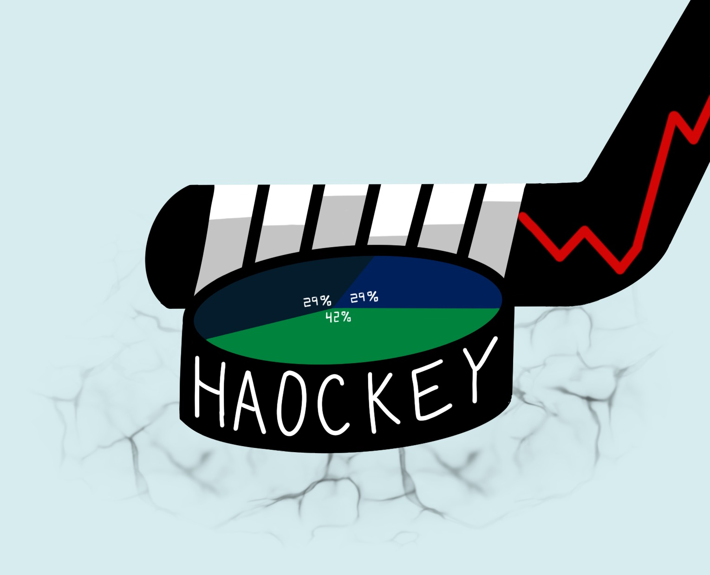

  

  <h3 align="center">Haockey</h3>

  

    <strong>All things fantasy hockey!</strong>
  

## Fantasy Pickup

1. Set .env file with app keys from yahoo
2. Run auth.py to create an auth.json file
3. Run main.py to do stuff

## Analysis

A data analysis of the 2021-2022 NHL season.